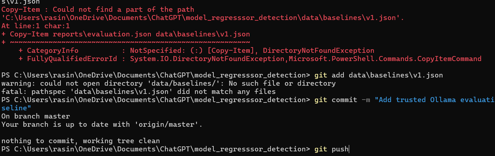
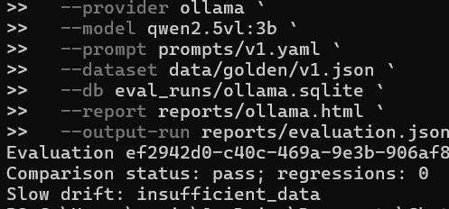

# Model Regression Detection

This project evaluates an LLM-powered customer-support email classifier against a human-verified golden dataset. Prompt or model changes can be evaluated locally and, later, in CI before they reach users.

## Current scope

The initial slice defines the contracts that the evaluation engine will consume:

- versioned YAML prompt configurations in `prompts/`;
- a Pydantic input/output contract for the classifier;
- an OpenAI-backed feature adapter with dependency injection for tests;
- versioned JSON golden data in `data/golden/`.

The evaluator, scoring, reports, Slack notifications, and GitHub Actions workflow are built on top of these interfaces.

## Run history and reports

Evaluation runs can be stored in SQLite and later used for trend data:

```python
from regression_detection import RunStore, write_html_report

store = RunStore("eval_runs/history.sqlite")
store.save(run)
baseline = store.get("previous-run-id")
history = store.recent(7, prompt_version=run.prompt_version, model=run.model)
write_html_report(run, "reports/evaluation.html", baseline=baseline, history=history)
```

The HTML report is self-contained: it includes the scorecard, baseline regressions, per-category deltas, and an inline pass-rate trend chart. No web server or external charting dependency is required.

The CLI is available after installation:

```powershell
model-eval --prompt prompts/v1.yaml --dataset data/golden/v1.json
```

Set `OPENAI_API_KEY` to run the live OpenAI adapter. Set `SLACK_WEBHOOK_URL` to send an optional Slack alert; the webhook is never required for local evaluation.

For semantic summary judging, add `--judge-model gpt-4o-mini`. Without this flag, the evaluator uses the deterministic keyword scorer and does not make additional judge requests.

## Local Ollama mode

Ollama can run the classifier locally without OpenAI API credits. Install Ollama, then pull a model that supports structured JSON output:

```powershell
ollama pull llama3.2:3b
ollama serve
model-eval --provider ollama --model llama3.2:3b --prompt prompts/v1.yaml --dataset data/golden/v1.json
```

Ollama exposes an OpenAI-compatible API at `http://localhost:11434/v1`; use `OLLAMA_BASE_URL` or `--ollama-base-url` when it runs elsewhere. The optional judge works locally too:

```powershell
model-eval --provider ollama --model llama3.2:3b --judge-model llama3.2:3b --prompt prompts/v1.yaml --dataset data/golden/v1.json
```

The evaluator also computes a slow-drift signal from the latest seven compatible runs. It reports `insufficient_data` until a complete window exists, then warns when the rolling pass-rate average falls below 90%.

## GitHub Actions setup

The workflow in `.github/workflows/evaluate-prompts.yml` runs for pull requests that change prompts, golden data, evaluator code, or project dependencies. Add these repository secrets under **Settings → Secrets and variables → Actions**:

- `SLACK_WEBHOOK_URL` — optional; enables Slack alerts.

The workflow can be started manually with **Actions → Evaluate prompt changes → Run workflow**. It runs the offline test suite, installs Ollama, evaluates with the pinned `qwen2.5vl:3b` model, uploads the HTML, Markdown, and JSON run reports, and comments the Markdown scorecard on pull requests. It compares against `data/baselines/v1.json`.

To create the first trusted baseline:

1. Run the workflow manually on the default branch with the current prompt.
2. Download `evaluation.json` from the workflow artifact.
3. Save it as `data/baselines/v1.json` and commit it after reviewing the report.
4. Future prompt pull requests will compare against that committed baseline.

## Container usage

```powershell
docker build -t model-regression-detection .
docker run --rm -e OPENAI_API_KEY=$env:OPENAI_API_KEY model-regression-detection
```

Mount a directory when retaining SQLite history or reports outside the container:

```powershell
docker run --rm -e OPENAI_API_KEY=$env:OPENAI_API_KEY `
  -v "${PWD}/eval_runs:/app/eval_runs" -v "${PWD}/reports:/app/reports" `
  model-regression-detection --db eval_runs/history.sqlite --report reports/evaluation.html
```

## Local setup

```powershell
py -3.11 -m venv .venv
.\.venv\Scripts\Activate.ps1
pip install -e ".[dev]"
pytest
```

To call the OpenAI adapter, set `OPENAI_API_KEY`. The adapter expects the model to return a JSON object with `category` and `summary` fields.

## Adding golden cases

Add a case to the next dataset version in `data/golden/`. Each case must have a stable `id`, input email, expected category, ideal summary, difficulty, and a note explaining why the case belongs in the set. Labels are human-authored ground truth; generated examples must be reviewed before inclusion.

The current v1 dataset contains 25 cases spanning all four categories, including typos, sarcasm, mixed-language input, ambiguous requests, and extremely short messages.

## Architecture direction

The LLM provider is isolated behind a small async adapter so the evaluator can be tested without network calls. Prompt files are data rather than Python code, which makes prompt changes visible to version control and CI. SQLite and JSON will remain the default persistence layer to keep local runs reproducible and portable.

## Demo evidence

The end-to-end demo follows a prompt change from branch to automated evaluation:

1. A prompt change is pushed to a pull request.
2. GitHub Actions runs the offline tests and the Ollama evaluation.
3. The run compares results against the committed baseline and publishes the report artifact.
4. The pull request receives the evaluation summary.

Successful workflow run:



Trusted baseline committed to the repository:



See the live [GitHub Actions workflow](https://github.com/rajaryan-14/model-regresssor-detection/actions) for the latest evaluation history.

See [System Diagrams](docs/diagrams.md) for the architecture, evaluation flow, and CI/CD workflow visuals.
