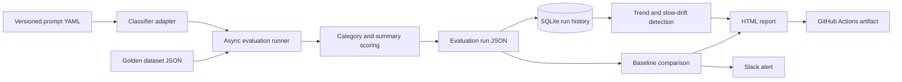
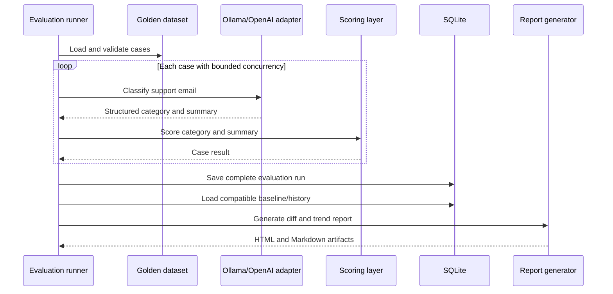
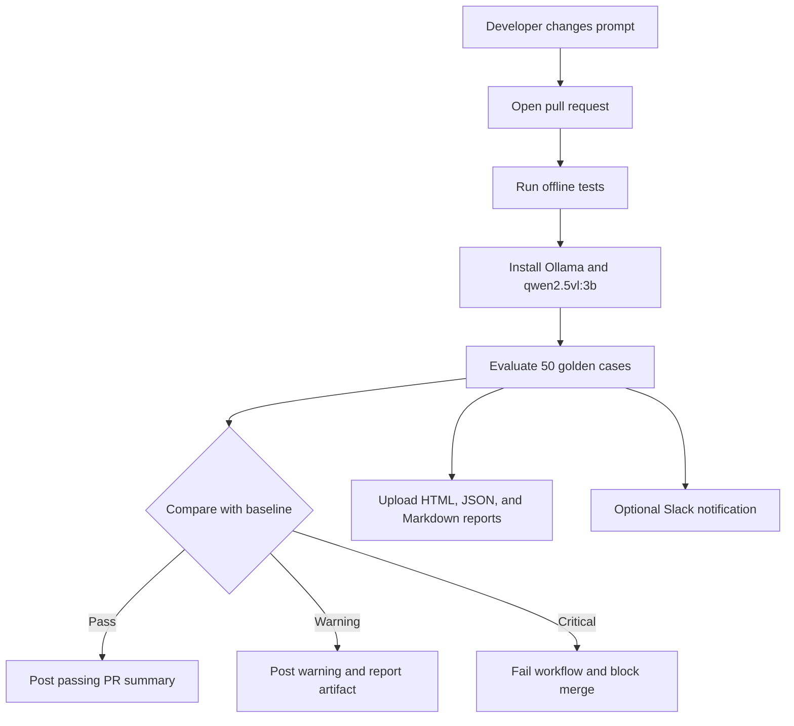

# System Diagrams

## 1. System architecture

## 2. Evaluation flow

## 3. CI/CD regression workflow

## Talking points

- The prompt and dataset are versioned inputs, so behavior changes are reviewable.
- The evaluator is provider-agnostic: the same interface supports Ollama locally and OpenAI when credits are available.
- Baseline comparison catches sharp regressions, while the seven-run rolling average catches slow drift.
- Failed model calls are retained as failed cases instead of hiding the problem by aborting the run.
